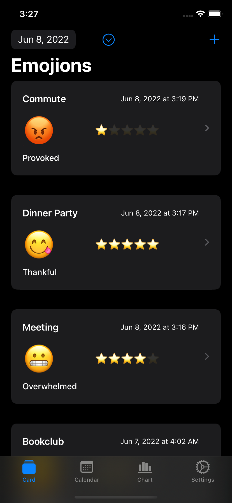
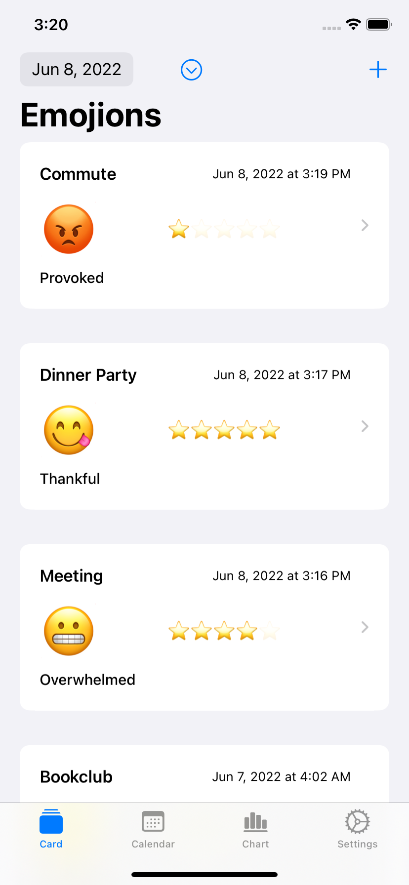
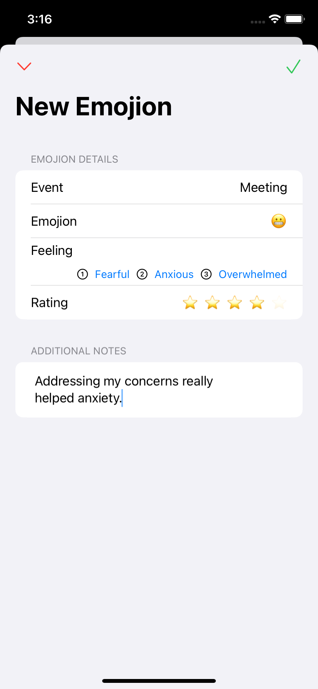
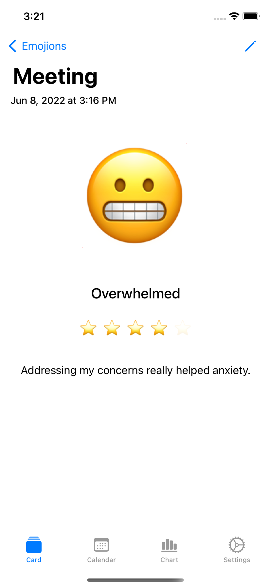
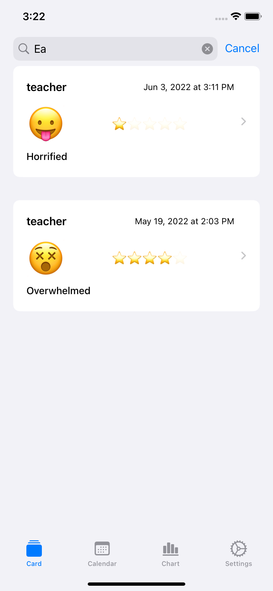
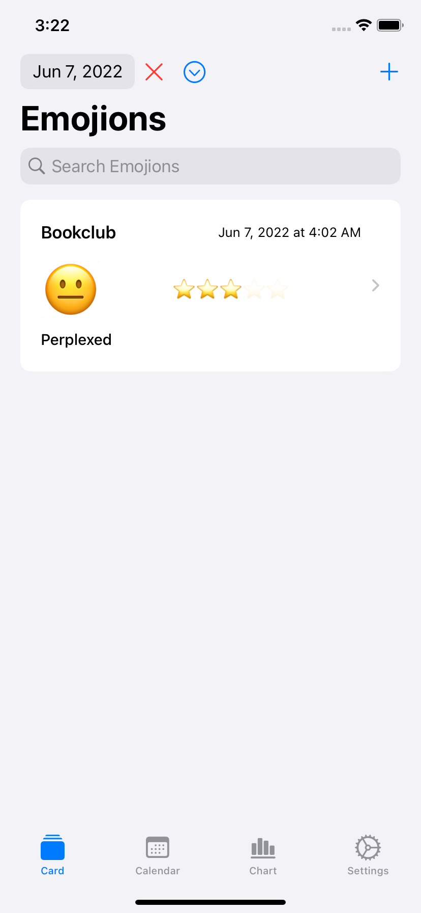
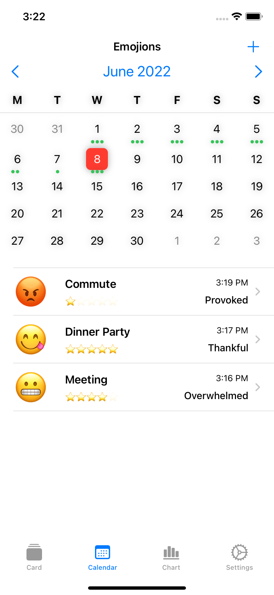
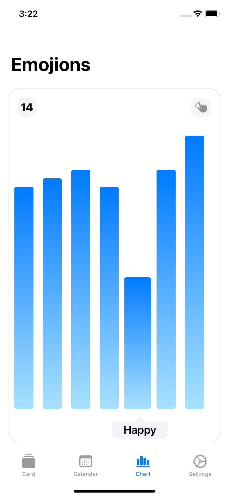

# Emojion
Log emotions with an emoji

Emojions uses simple emojis to track your mood.
Journaling your mood over time can help you improve your habits leading to increased happiness and well-being.

Emojion also features a feeling wheel to lock in on an exact emotion, with the ability to rate and experience and leave notes for reflection.

Emojion has a search function and a date picker. If you dont know what exactly your searching for, Emojion has a calendar view so you can browse through previous entries.

Emojion also features a chart view, so you can see what emotions you've felt the most.

# Screenshots
### iOS
| | |
|---------------------|---------------------|
| | |
| | |
| | |
